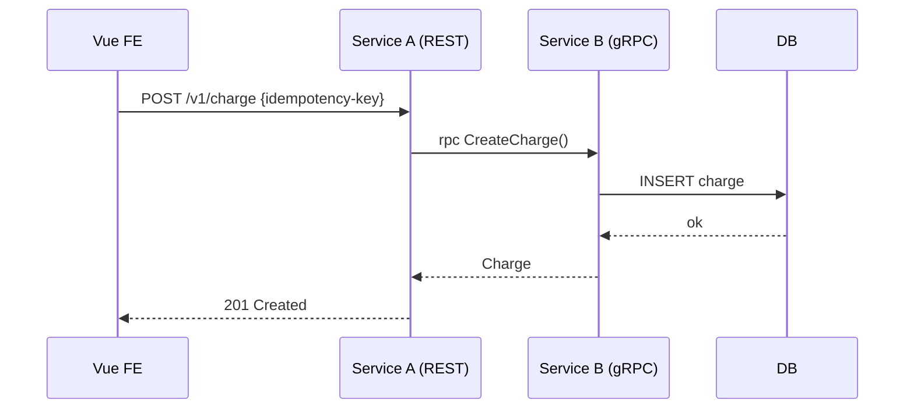

# Tech Design — <Feature Name>

| Field | Value |
|---|---|
| **Status** | DRAFT / IN-REVIEW / **SIGNED** |
| **Owner (Tech Lead)** | <nama> |
| **Cross-tribe Reviewer** | <nama, tribe X> |
| **PRD link** | `features/<slug>/PRD.md` |
| **Signed at Gate 2** | YYYY-MM-DD |

---

## 1. Context

(Ringkasan 1-2 paragraf. Link ke PRD. State of the world sekarang.)

## 2. Goals & Non-Goals

- **Goals:**
  - ...
- **Non-goals:**
  - ...

## 3. Options Considered (Minimal 3)

### Option A — <judul>

- **Cara kerja:** ...
- **Pros:** ...
- **Cons:** ...
- **Effort:** S/M/L
- **Risk:** L/M/H

### Option B — <judul>

(idem)

### Option C — <judul>

(idem)

### Trade-off Matrix

| Aspek | A | B | C |
|---|---|---|---|
| Latency | | | |
| Effort | | | |
| Operational complexity | | | |
| Risk regression | | | |
| Reversibility | | | |

## 4. Decision (= ADR)

**Pilih: <Option X>**

**Rationale:** (kenapa dipilih, dengan referensi explicit ke trade-off matrix)

**Konsekuensi:** (apa yang kita terima sebagai cost-of-decision)

## 5. API Contract

### REST (kalau ada)

```yaml
# features/<slug>/contract/openapi.yaml (canonical), di-sync ke api/openapi.yaml via `make feature-apply`
paths:
  /v1/<resource>:
    post:
      summary: ...
      requestBody:
        content:
          application/json:
            schema: ...
      responses:
        '201': ...
        '422': ...   # validation error, friendly message
```

### gRPC (kalau ada)

```proto
// features/<slug>/contract/proto/<service>.proto (canonical), di-sync ke api/proto/ via `make feature-apply`
service Payment {
  rpc CreateCharge(CreateChargeRequest) returns (Charge) {}
}
```

## 6. Data Model

(ERD atau struct definition. Sertakan migration plan kalau ada DDL.)

```sql
-- features/<slug>/migrations/001-<name>.up.sql (canonical), di-sync ke migrations/ via `make feature-apply`
CREATE TABLE ...
```

## 7. Sequence Diagram



## 8. Failure Modes & Recovery

| Mode | Probability | Detection | Recovery |
|---|---|---|---|
| DB connection drop | M | health-check + alert | retry exp backoff; circuit breaker |
| Downstream timeout | M | metric + trace | fail-fast 504; client retry idempotent |
| Partial write | L | reconciliation job | dual-write + outbox pattern |

## 9. Observability Plan

- **Logs:** event names: `<service>.charge.created`, `<service>.charge.failed`, dst.
- **Metrics:** `<service>_charge_total{result=success|failed}`, `<service>_charge_latency_ms`
- **Traces:** propagate `X-Trace-Id`. Span name: `<service>.<operation>`.
- **Dashboard:** <link Grafana>
- **Alerts:** SLO `<name>` (link runbook)

## 10. Rollout Plan

- [ ] Behind feature flag: `<flag_name>` (default off)
- [ ] Canary: 1% traffic for 24h, then 10%, then 100%
- [ ] Rollback plan: toggle flag off; data backward-compatible (no destructive migration)

## 11. Security & Privacy Notes

- Field PII yang masuk: <list>
- Backend strip + frontend hide (defense-in-depth)
- Banned-field test added: yes / no

## 12. Open Items (sebelum Gate 2)

- [ ] ...

## 13. Approval Gate 2

| Role | Nama | LGTM-TD | Tanggal |
|---|---|---|---|
| Tech Lead | | | |
| Cross-tribe reviewer | | | |
